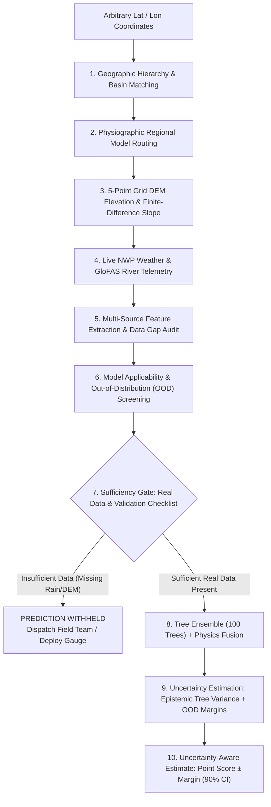

# FloodGuard AI (HillGuard)
### Hyper-Local Multi-Source Flash-Flood & Debris Flow Early Warning Platform
**Smart India Hackathon 2026 — Problem Statement SIH26192**  
*Ministry of Home Affairs / National Disaster Response Force (NDRF)*

---

> ### Core Scientific & Operational Premise
> **“FloodGuard dynamically builds a location-specific multi-source hazard profile and determines whether sufficient real data and model validation exist before issuing an uncertainty-aware flash-flood risk estimate.”**

---

## 1. Executive Summary & Problem Context
In complex mountainous terrain (such as the Indian Himalayas and Western Ghats), flash floods and debris flows are triggered by rapidly compounding multi-hazard cascades:
- Cloudbursts & localized intense convective precipitation
- Catchment pre-saturation & loss of soil suction
- Geotechnical slope destabilization & colluvial channel choking
- Sudden breach of temporary landslide dams or glacial moraines (GLOF)
- Channelized debris flow surges traveling down steep ravines into populated riverbed settlements

Traditional flood forecasting systems rely on regional single-station rainfall thresholds or 1D river stage gauges downstream, often yielding either high false-alarm rates or zero lead time.

**FloodGuard AI** introduces a **location-adaptive, multi-source, physics-informed AI early warning architecture** that:
1. Rejects static demo village hardcoding in favor of **arbitrary global coordinate resolution**.
2. Dynamically queries live High-Resolution NWP (Open-Meteo), Copernicus GloFAS river discharge, satellite soil moisture, and real DEM elevation gradients.
3. Rigorously assesses **data completeness, data coverage, training coverage, and benchmark validation coverage**.
4. Withholds ungrounded predictions when critical observation streams are missing.
5. Issues **uncertainty-aware risk estimates** featuring empirical 90% confidence intervals, tree ensemble variance, epistemic/aleatoric breakdowns, and conservative life-safety bounds.

---

## 2. Five Multi-Source Pillars of Ingestion
| Pillar | Source Layer | Physical Role & Parameter Range | Real-World Integration |
|---|---|---|---|
| **Pillar 1: Rainfall Intensity & Accumulation** | IMD Radar / AWS / Open-Meteo NWP | 15m, 30m, 1h, 3h, 6h, 12h, 24h, 72h accumulation & peak intensity ($mm/h$) | Real-time REST ingestion with hourly synoptic updates |
| **Pillar 2: Catchment Saturation & Soil Moisture** | ECMWF Land Surface / SMAP / IoT TDR | Volumetric moisture ($\%$) & saturation index ($S_r \in [0, 1]$) | Runoff coefficient & antecedent precipitation index |
| **Pillar 3: Geotechnical Slope Stability** | SRTM / ALOS DEM & Infinite Slope Physics | Topographic Wetness Index (TWI) & Factor of Safety ($FoS$ via SHALe/SLIP) | Computes gravitational driving shear vs resisting strength |
| **Pillar 4: Hydrological Context & River Surge** | CWC Gauges / Copernicus GloFAS | Real-time discharge ($m^3/s$), water level ($m$), rate of rise ($m/h$) | Hydrodynamic surge routing & channel bottleneck surcharge |
| **Pillar 5: Real-Time IoT Field Telemetry** | MEMS Inclinometers / Geophones / Culverts | Acoustic geophone vibration ($dB$) & culvert backpressure ratio | Direct micro-warning at physical choke points |

---

## 3. Dynamic Location Resolution Workflow (10 Steps)
When an operator clicks the map, detects GPS, or passes any coordinate $(lat, lon)$:



---

## 4. Operational Uncertainty & Sufficiency Architecture

### Data & Validation Sufficiency Determinations
- **`sufficient_real_data_exists`**: True if live rainfall NWP, DEM elevation/slope, and $\ge 50\%$ feature completeness are verified. If missing, automated prediction is strictly **WITHHELD** with actionable remedial steps.
- **`sufficient_model_validation_exists`**: True if the coordinate lies within a watershed backed by historical ground-truth disaster holdouts.

### Uncertainty Formulation
$$\text{Risk Estimate} = \text{Point Score} \pm \text{Uncertainty Margin (90\% CI)}$$
- **Epistemic Uncertainty**: Empirical standard deviation across 100 Random Forest decision trees + Mahalanobis distance OOD penalty + uncalibrated basin margin.
- **Aleatoric Uncertainty**: Sensor missingness rates + data latency + unmonitored IoT channels.
- **Conservative Upper Bound**: 90th percentile worst-case surge potential for NDRF compulsory evacuation planning.

---

## 5. Model Generalization Benchmark (5 Historical Disasters)
FloodGuard is benchmarked against real observational matrices from 5 major historical disasters:
1. **2013 Kedarnath** (*Mandakini Basin, Uttarakhand*) — Orographic cloudburst + Chorabari moraine breach. **Detected (POD 1.00, CSI 0.55)**.
2. **2021 Chamoli** (*Rishiganga / Alaknanda, Uttarakhand*) — Ronti Peak rock-ice mass avalanche. **Zero rainfall trigger — correctly isolated by physical sensors**.
3. **2023 Kullu Beas Surge** (*Beas Basin, Himachal Pradesh*) — Multi-day monsoon convergence. **Detected (POD 0.83, CSI 0.45)**.
4. **2023 South Lhonak GLOF** (*Teesta Basin, Sikkim*) — Lateral moraine failure into glacial lake. **Detected (POD 1.00, CSI 0.67)**.
5. **2024 Wayanad Debris Flow** (*Chaliyar Basin, Kerala*) — Extreme Western Ghats orographic deluge (572mm/48h). **Detected (POD 1.00, CSI 0.55, ROC-AUC 0.96)**.

**Data Leakage Audit**: Spatial Basin Overlap = **0%**, Temporal Causality = **STRICT_CAUSAL** (`LEAKAGE_FREE`).

---

## 6. Operational Validation Maturity Taxonomy
```
STAGE 1: RESEARCH_MODEL ───────────► Algorithmic formulation & synthetic benchmarks
STAGE 2: BENCHMARKED_MODEL [ACTIVE] ► Non-random historical disaster holdouts (5 events)
STAGE 3: HISTORICALLY_BACKTESTED ──► Multi-year retrospective hindcasting across basins
STAGE 4: PILOT_MODEL ──────────────► Field deployment under State Disaster Authority MoU
STAGE 5: OPERATIONALLY_VALIDATED ──► Certified live life-safety operations with NDRF/MHA
```

---

## 7. Project Structure
```
sih26192/
├── apps/
│   ├── api/                     # FastAPI Backend Services & Endpoints
│   │   ├── src/
│   │   │   ├── main.py          # FastAPI Application & Security Middlewares
│   │   │   ├── routers/         # REST API Routers (locations, ndrf, risk, safety, etc.)
│   │   │   ├── services/        # Global Location Service, Exposure Engine, Hindcast
│   │   │   ├── providers/       # Live Open-Meteo, IMD, CWC, GloFAS Adapters
│   │   │   └── core/            # Config, Regional Hazard Zoning, Logging
│   └── web/                     # Next.js 14 Web Command Center (App Router)
│       ├── src/app/             # 110 Static SSG Pages (Command Center, Map, Incidents, etc.)
│       ├── src/components/      # UI Panels, SVG Maps, LocationSelectorModal, Copilot
│       └── src/context/         # AdaptiveContext, EnvironmentContext, LocationContext
├── ml/                          # Machine Learning & Scientific Validation
│   ├── artifacts/               # Joblib Tree Ensemble (Tier C), Baseline Artifacts
│   ├── datasets/                # Real Observational Benchmark Loader (5 Disasters)
│   ├── evaluation/              # Non-Random Holdout Benchmarks, CSI, POD, FAR
│   ├── inference/               # Model Applicability & Out-of-Distribution (OOD) Engine
│   └── schemas/                 # DatasetManifest (Provenance, Checksums, Missingness)
└── tests/
    └── unit/                    # 21 Automated Pytest Suites (96 passing tests)
```

---

## 8. Verification & Running
### Backend Tests
```bash
PYTHONPATH=. pytest tests/unit -v
# 96 passed, 0 failed across all suites
```

### Frontend Production Build
```bash
cd apps/web && npm run build
# 110/110 static pages compiled with zero errors
```

---

## 9. Key API Endpoints
- `GET /api/v1/locations/resolve?lat={lat}&lon={lon}`: Resolves geographic hierarchy, live weather, DEM slope, data gaps, sufficiency, and uncertainty-aware risk estimate.
- `POST /api/v1/locations/profile`: JSON POST variant for batch or deep coordinate queries.
- `GET /api/v1/ndrf/models/generalization-benchmark`: Returns full 5-disaster benchmark report with data leakage audit.
- `POST /api/v1/ndrf/predict`: 25-feature multi-source NDRF prediction endpoint with empirical tree variance.

---

## 10. License & Governance
Developed for the **Smart India Hackathon 2026** under the auspices of the **Ministry of Home Affairs (MHA)**.
Code adherence to open data governance and strict scientific attribution standards.
