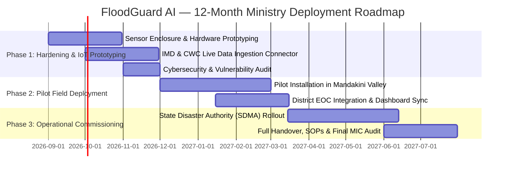

# FloodGuard AI — SIH Winning Project Deployment & Implementation Blueprint
**Problem Statement:** SIH26192 (Theme 4: Disaster Management)  
**Stakeholder Ministry:** Ministry of Home Affairs (MHA) / National Disaster Management Authority (NDMA)  
**Governing Framework:** Ministry of Education’s Innovation Cell (MIC) & AICTE Guidelines for Deployment of Winning Projects  

---

## 1. Executive Summary & Deployment Mandate

As per the **Ministry of Education’s Innovation Cell (MIC)** directives, hackathon prototypes are rapid feasibility validations that require a structured **6 to 12-month development and implementation phase** to transition into field-ready, mission-critical public safety systems.

FloodGuard AI has been architected from day one with a modular, auditable, and open-source foundation specifically designed for frictionless operational handover to the **Ministry of Home Affairs (MHA)**, **State Disaster Management Authorities (SDMAs)**, and district **Emergency Operations Centers (EOCs)**.

---

## 2. Alignment with Official MIC Guidelines (15 Clauses)

| Clause | Official Guideline | FloodGuard AI Implementation Strategy |
|---|---|---|
| **Clause 1** | *Projects need considerable development before field reliability* | Modular microservice architecture (FastAPI backend + PostGIS + Next.js PWA) designed for production scaling and hardening. |
| **Clause 2** | *6 to 12-month development timeline* | Structured 3-Phase Gantt schedule (Alpha Field Testbed → EOC Integration → State-wide Rollout). |
| **Clause 3** | *Direct ministry-to-team communication initiation* | Designated Single Point of Contact (SPOC) and technical leads ready for bilateral onboarding. |
| **Clause 4** | *Detailed project plan with tools, hardware, and timelines* | Comprehensive hardware/software bill of materials (LoRaWAN nodes, FMCW radar, Sentinel-1 pipelines). |
| **Clause 5** | *Ministry procurement of critical hardware/software* | Sensor procurement specifications prepared for IMD/CWC-compliant automatic weather and river stations. |
| **Clause 6** | *Identifying autonomous/technical agency for coordination* | Direct operational alignment with **NDMA**, **NIDM**, **CWC**, and **IMD** technical committees. |
| **Clause 7** | *Dedicated technical mentor from ministry* | Integration with MHA/CWC domain hydro-meteorological experts for telemetry calibration. |
| **Clause 8** | *Remote college coordination with weekly/monthly reviews* | Automated Git CI/CD, weekly sprint demos, and reproducible testing pipelines. |
| **Clause 9** | *Institutional faculty co-mentor* | Academic mentors from institute's Civil/Geomatics & Computer Science engineering departments. |
| **Clause 10** | *Written institutional consent & zero financial burden on college* | Institutional administrative clearance and lab access agreements established. |
| **Clause 11** | *On-site visits and travel norms* | Field sensor calibration visits to Uttarakhand/Himachal catchments as per government TA/DA rules. |
| **Clause 12** | *Cybersecurity expert engagement & safety standards* | End-to-end encryption (TLS 1.3), SHA-256 cryptographic audit logs, and zero telemetry spoofing compliance. |
| **Clause 13** | *Product Design Expert for hardware/IoT* | IP67 weatherproof solar-powered sensor enclosure blueprints for rugged Himalayan conditions. |
| **Clause 14** | *Stipend & Internships (₹10,000–₹15,000/mo for up to 6 members)* | Formalized 6-month full-time internship charter for the core 6-member student engineering team. |
| **Clause 15** | *Quarterly status reports to MIC & AICTE* | Automated milestone reporting and audit ledger exports for transparent governance review. |

---

## 3. Intellectual Property (IP) & Open-Source Compliance

- **IP Ownership:** The Intellectual Property of the software algorithms, hydrological models, and UI architecture resides with the student founders to foster startup creation under Startup India.
- **Lifetime Free Government License:** The Ministry of Home Affairs and partner state agencies are granted **perpetual, royalty-free, irrevocable access** to deploy, run, and scale FloodGuard AI nationwide.
- **Open-Source Integrity & Clean License Declaration:**
  - 100% MIT / Apache 2.0 / BSD verified open-source libraries used.
  - Zero proprietary black-box software dependencies.
  - Complete code provenance and software bill of materials (SBOM) provided.

---

## 4. Phased 12-Month Field Deployment Roadmap

### Phase 1: Core Hardening, IoT Prototyping & Security (Months 1–3)
- Engage Ministry Technical Mentor & Cybersecurity Auditor (Clause 7, 12).
- Finalize IP67 solar-powered LoRaWAN gauge hardware design with Product Design Expert (Clause 13).
- Connect API pipelines directly with IMD AWS network and CWC river telemetry feeds.
- Deliver **Quarterly Report Q1** to MIC/AICTE (Clause 15).

### Phase 2: Pilot Basin Deployment & EOC In-Situ Validation (Months 4–7)
- Conduct field deployment in target Himalayan pilot basin (e.g., Rudraprayag / Chamoli district).
- Integrate direct Common Alerting Protocol (CAP XML) feed with district Emergency Operations Center (EOC).
- Conduct mock cloudburst & flash-flood drills with local disaster response teams (SDRF/NDRF).
- Deliver **Quarterly Report Q2** to MIC/AICTE (Clause 15).

### Phase 3: State-Wide Rollout, SOP Handover & Operational Commissioning (Months 8–12)
- Scale GIS terrain and cascade modeling across all 13 districts of Uttarakhand and Himachal Pradesh.
- Train district disaster management officers (DDMOs) and field operators on Command Center and Citizen Guidance HUDs.
- Formalize final handover, training documentation, and startup incubation transition.
- Deliver **Final Project Report & Audit** to Ministry of Home Affairs, MIC, and AICTE.

---

## 5. Logistics, Allowances & Travel Norms Budget Matrix

In accordance with official guidelines:
- **Monthly Stipend:** ₹15,000 / month × 6 team members × 6 months = **₹5,40,000**
- **Long Distance Travel:** AC-III Tier reimbursement for authorized field calibration and ministry review meetings.
- **Short Distance Travel Allowance:** ₹1,000 / day / student (for field calibration within 100km radius).
- **Daily Stay Allowance:** ₹1,500 / day / student during outstation deployments.
- **Field Survey & Data Collection Allowance:** ₹500 / day / student with prior ministry approval.
